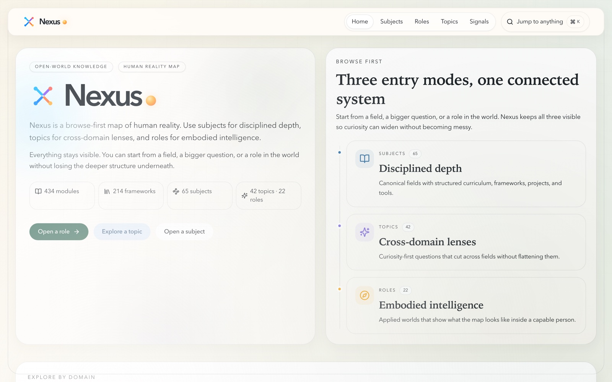
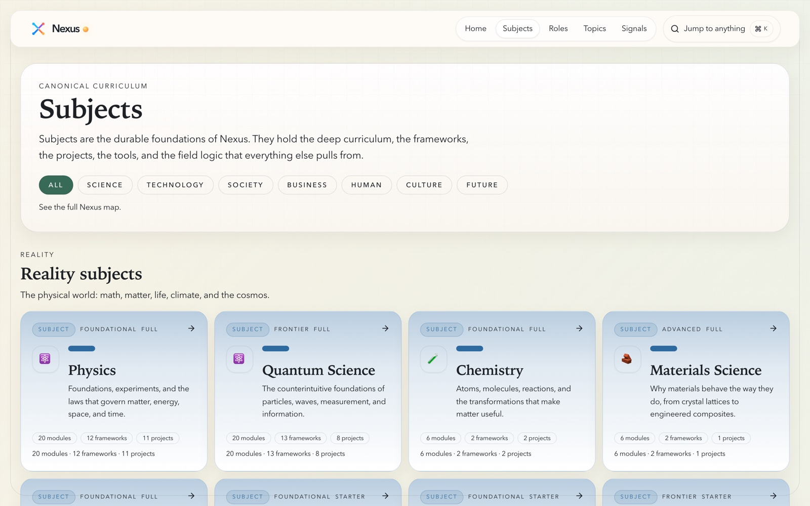
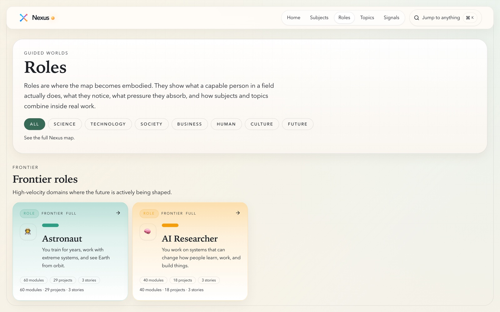
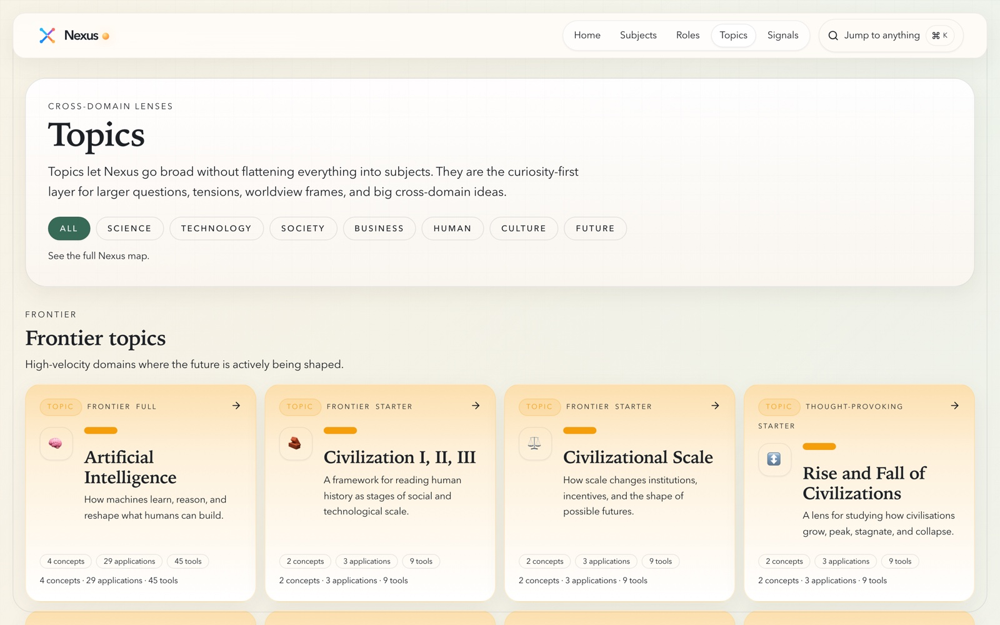
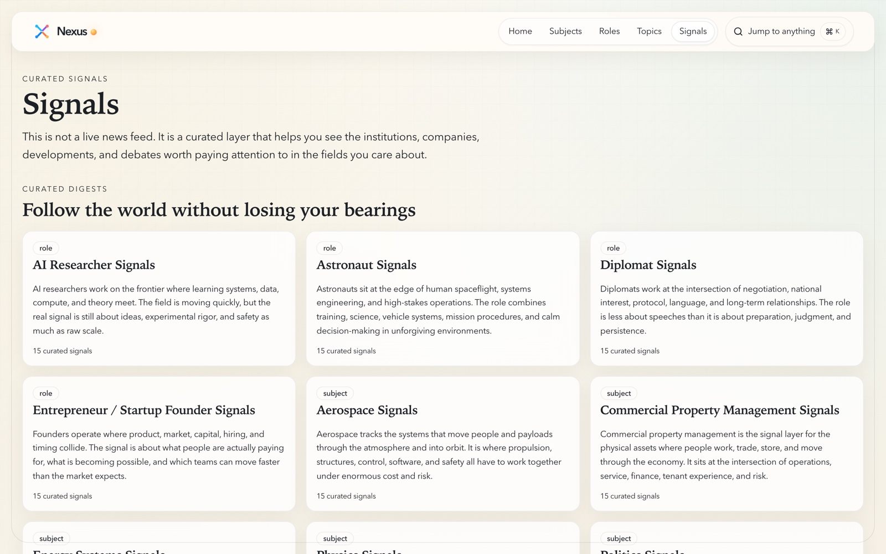
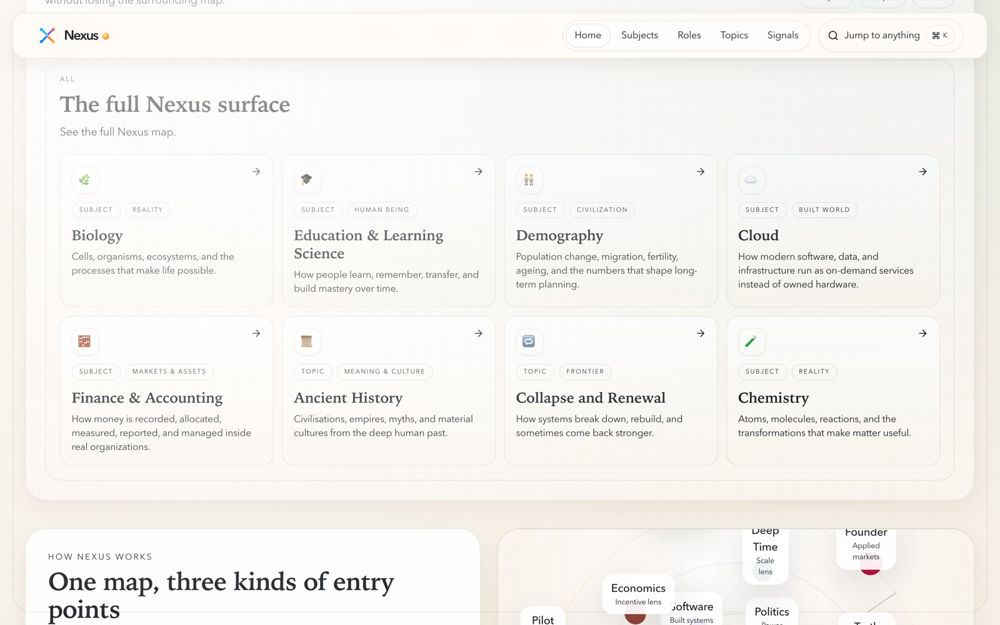
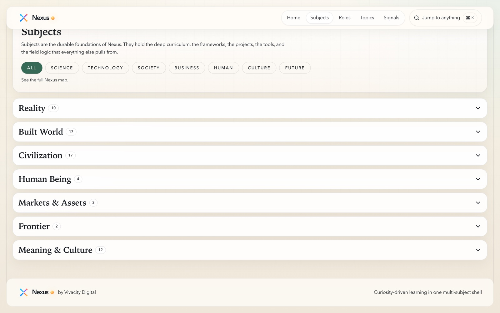

# ✳️ Nexus

> A browse-first map of human reality. **65 subjects** for disciplined depth, **42 topics** for
> cross-domain lenses, and **22 roles** for what the map looks like inside a capable person -
> one connected system, no account, no backend.

**[▶ Open the live app](https://vdapp33-personal-academy.vercel.app)** - nothing to sign up for, nothing to configure.

```bash
git clone https://github.com/BrysonW24/vdapp33-personal-academy.git
cd vdapp33-personal-academy
npm install && npm run dev
```

Open <http://localhost:3000>. Press <kbd>⌘</kbd><kbd>K</kbd> and jump to anything. ✨

<p align="center">
  
</p>

---

## 🧠 The idea: three entry modes, one corpus

Most learning apps make you pick a course and walk a line. Nexus assumes curiosity does not work
like that. The same body of knowledge is cut **three different ways**, and all three stay visible:

| Mode | Count | What it gives you |
|---|---|---|
| 📘 **Subjects** | **65** | *Disciplined depth.* Canonical fields with structured curriculum, frameworks, projects and tools. |
| ✨ **Topics** | **42** | *Cross-domain lenses.* Curiosity-first questions - consciousness, collapse, deep time, meaning - that cut across fields without flattening them. |
| 🧭 **Roles** | **22** | *Embodied intelligence.* Astronaut, diplomat, intelligence analyst, AI researcher: what the person actually does, notices, and absorbs. |

**Topics are lenses, not copies.** A topic owns no modules of its own - it derives them at runtime
from its related subjects. So "Existential Risk" assembles a real reading path out of the physics,
biology, and civilization material already in the corpus, instead of duplicating it.

## 📊 What is actually in here

Counted from disk. The homepage computes the same totals from the content tree at build time, so
the numbers on the live site and the numbers here cannot drift apart.

| | | | |
|---|---|---|---|
| **65** subjects | **42** topics | **22** roles | **3,256** content files |
| **743** modules | **671** lessons | **565** tools | **443** frameworks |
| **285** projects | **132** day-in-the-life | **100** topic sections | **0** backend services |

## 🗺️ Discovery: buckets, filters, palette

Three layers sit above the raw catalogue so 128 entities stay navigable:

- **7 macro buckets** - Reality · Human Being · Civilization · Built World · Markets & Assets ·
  Meaning & Culture · Frontier. Each bucket deliberately mixes subjects, topics **and** roles
  rather than showing one kind, so widening your curiosity does not mean leaving the structure.
- **A plain-language filter rail** - All · Science · Technology · Society · Business · Human ·
  Culture · Future. For when you do not yet know the name of the thing you want.
- **A command palette** - <kbd>⌘</kbd><kbd>K</kbd> / <kbd>Ctrl</kbd><kbd>K</kbd>, "Jump to
  anything". Indexes every entity, section and signal plus module entries. Entirely client-side;
  there is no search service.

<p align="center">
  
  
</p>
<p align="center">
  
  
</p>

## 🧩 How a subject unfolds

Land on **Start Here** → **Blueprint** (the field mapped from module order) → **Modules** → a
**lesson** (with a perspective toggle, quiz and completion badge) → **Projects** → **Tools** →
**Toolkit** (frameworks and mental models) → **Day in the Life** → **Sources** (the curated truth
stack) → **Signals**.

Lessons are written against a four-lens teaching model - **Concept → Mechanism → Importance →
Application** - so a page tells you what a thing is, how it works, why it matters, and where you
would use it, in that order.

Eleven bespoke SVG visualisation components (career ladders, concept maps, mastery rings, exposure
maps, comparison matrices, gauge arcs) carry the explanation where prose gets heavy.

<p align="center">
  
  
</p>

## 🎯 Optional: guided mode

The browse shell is the front door, but a guidance layer persists for anyone who wants a structured
session. `/setup` runs a soft onboarding into a deterministic blueprint engine with three modes -
**guided**, **explorer**, **operator** - producing a `/my-path` dashboard: one core subject, one
supporting topic, one role lens, one current project, and a weekly cadence with a review loop, plus
a ranked next-best-action list.

## 🔒 Privacy, by architecture

- **No accounts, no auth, no database, no API routes.** Zero `route.ts` files in the app.
- **No telemetry.** Progress and onboarding live in `localStorage` and are never transmitted.
- **No configuration.** `.env.example` holds one `NEXT_PUBLIC_` variable pointing at localhost.
- Content is read from JSON on disk at build time and validated through Zod schemas, so a malformed
  content file **fails the build** rather than shipping a broken page.

## 🛠️ Tech stack

**Next.js 15.5.14** App Router (pinned) · **React 19** · **TypeScript 5.7** (strict) ·
**Tailwind CSS 3.4** · **Zustand 5** · **Zod 3.24** · **Framer Motion 12** · **Radix UI**
(7 primitives) · **three** + **@react-three/fiber** + **drei** for the 3D hierarchy scene
(`hidden md:block`, so phones never pay for it) · **Vitest 3.2**.

~23,400 lines of TypeScript across 46 pages and 17 dynamic segments. Node >= 20.

```bash
npm run dev          # dev server
npm run build        # production build
npm run test         # vitest run
npm run type-check   # tsc --noEmit
npm run lint         # eslint
```

## ✅ Tests

**3 suites, 709 lines, 12 cases** - and the important one is real:

- `catalog-completeness.test.ts` hardcodes all **128 entity slugs** and asserts every one resolves
  through the real loaders against the real content tree. It fails in **both** directions, so a
  deleted subject and an unregistered new subject each break the build.
- `academy-engine.test.ts` covers profile building, path generation, next-action ranking and
  path-membership explanation.
- `progress.test.ts` covers localStorage progress migration, including legacy slug remapping.

## ⚠️ Honest status

- **There is no CI.** No `.github/` directory, so the test suite above only runs when someone runs
  it locally. Nothing gates a push.
- **Coverage is deliberately uneven, and the UI states it** rather than hiding it:
  - **33 of 65** subjects have day-in-the-life scenarios.
  - **15 of 22** roles own their own modules; the other 7 are day-in-the-life only.
  - **23 of 128** entities have curated sources and signals packs. The rest render an honest empty
    state ("truth stack is still being curated"), not a fabricated one.
- **Topics have no blueprint, lesson or day-in-the-life routes** - a real asymmetry against
  subjects and roles, because a lens is not a field.

## 🧬 Lineage

Nexus replaced six standalone single-subject academies - politics, physics, aerospace, rocket
science, quantum science and commercial property management - each of which now lives as a subject
inside one shell with one deploy and one progress model. `energy-systems` was promoted the other
way, from topic-level content into a full subject. Migration notes:
[`docs/personal-academy-migration-analysis.md`](docs/personal-academy-migration-analysis.md).

## 📄 Licence

No licence file is present, which under GitHub's terms means **all rights reserved** - you may view
this repository, but not reuse it. If you want to build on it, open an issue and ask.

---

<p align="center">
  <em>Nexus - part of the Vivacity app portfolio.</em><br />
  <a href="https://vdapp33-personal-academy.vercel.app">Live app</a> ·
  <a href="CLAUDE.md">Architecture notes</a> ·
  <a href="docs/">Docs</a> ·
  <a href="status/">Delivery status</a>
</p>
